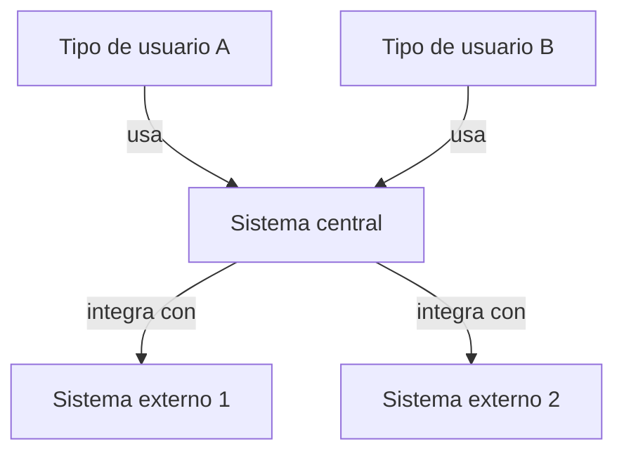

> Documento derivado automáticamente del código de este repositorio — se regenera, no editar a mano en silencio; lo que el código no sabe va en `_ACLARACIONES.md`.

# Diagrama de Contexto (C1) — [Nombre de la aplicación]

El sistema como una caja central, los tipos de usuarios que interactúan con él y los sistemas externos con los que se integra.

## Relaciones

- **[Usuario A] → [Sistema]**: [descripción breve]
- **[Sistema] → [Externo 1]**: [descripción breve]
- **[Sistema] → [Externo 2]**: [descripción breve]
