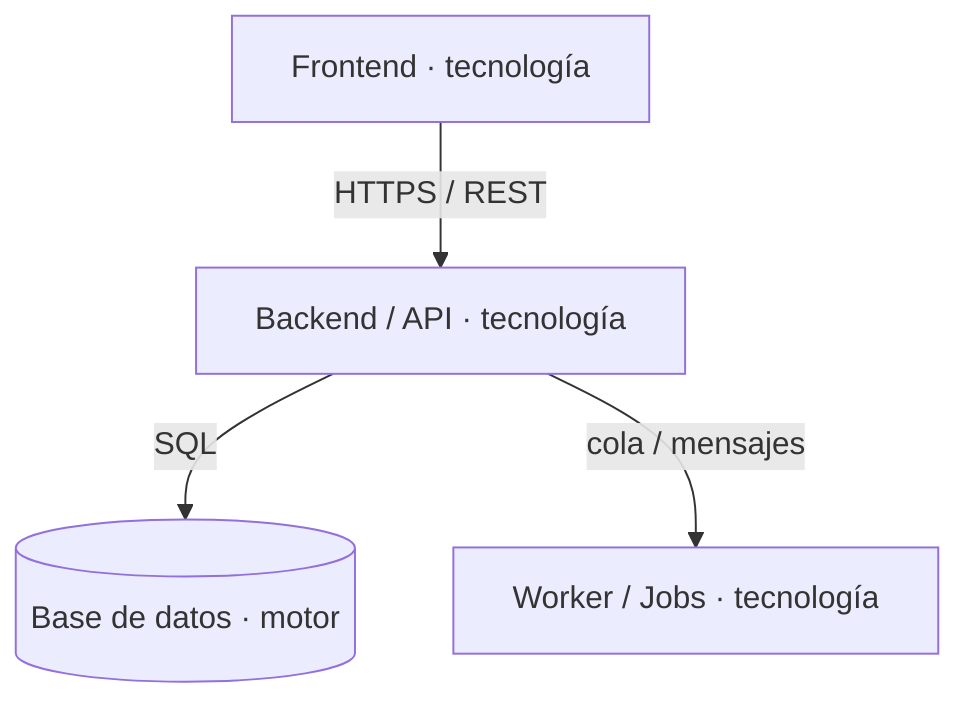

> generado por /docs-fyd [FECHA] — se regenera, no editar a mano.
> 🔒 Derivado de los configs de deploy/CI (fuente #1 de secretos inline): NINGÚN valor de credencial acá — solo nombre de contenedor, tecnología y protocolo.

# Diagrama de Contenedores (C2) — [Nombre de la aplicación]

Cada contenedor desplegable por separado, su tecnología y el protocolo de comunicación entre ellos.

## Contenedores

| Contenedor | Tecnología | Comunicación |
|---|---|---|
| [nombre] | [tecnología — o NO DETERMINADO] | [protocolo] |
