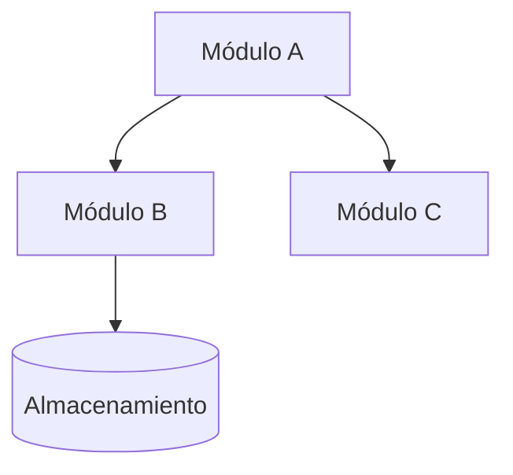

> Documento derivado automáticamente del código de este repositorio — se regenera, no editar a mano en silencio; lo que el código no sabe va en `_ACLARACIONES.md`.

# Diagrama de Componentes (C3) — [contenedor]

<!-- Si la app es simple, este artefacto lleva SOLO la nota "No aplica" de abajo. Los 10 artefactos SIEMPRE existen (regla de oro 6): ninguno se omite. -->

Módulos internos del contenedor [nombre] y cómo se relacionan.

## Componentes del contenedor [nombre]

| Módulo | Responsabilidad |
|---|---|
| [módulo] | [qué hace] |

---
**Si no aplica:** _No aplica — [razón, ej.: la aplicación es un monolito simple sin complejidad interna que justifique el nivel C3]._
