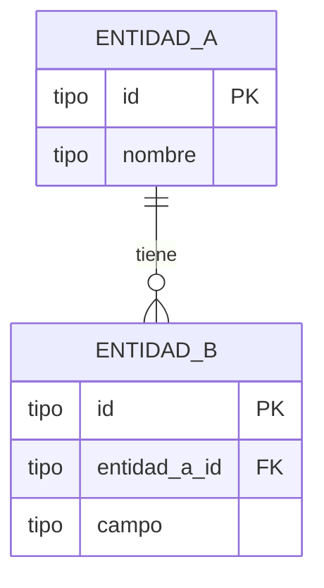

> generado por /docs-fyd [FECHA] — se regenera, no editar a mano.

# Modelo de datos (Entidad-Relación) — [Nombre de la aplicación]

Tablas principales, sus columnas clave (primaria, foráneas y campos relevantes) y el tipo de relación entre ellas. Derivado de migraciones / modelos / schema.

## Notas

- [tablas principales y su propósito]
- [relaciones clave]

---
**Si no aplica:** _No aplica — [razón, ej.: la aplicación no tiene base de datos propia / persiste solo en un servicio externo]._
