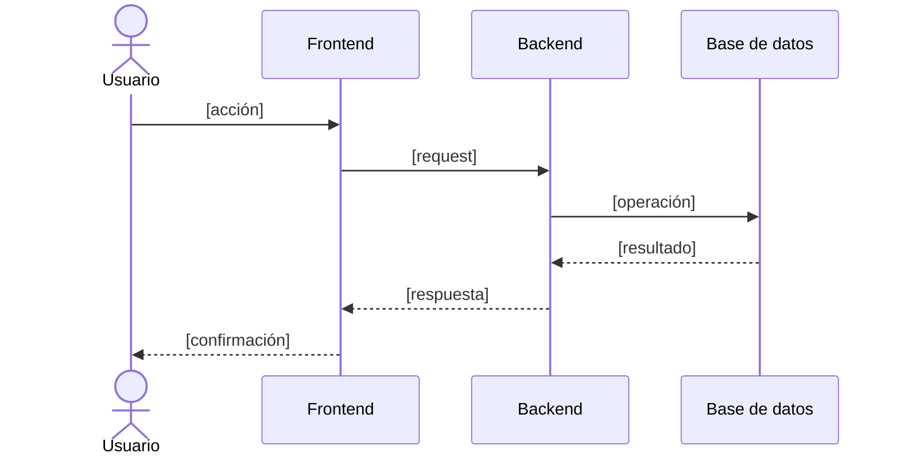
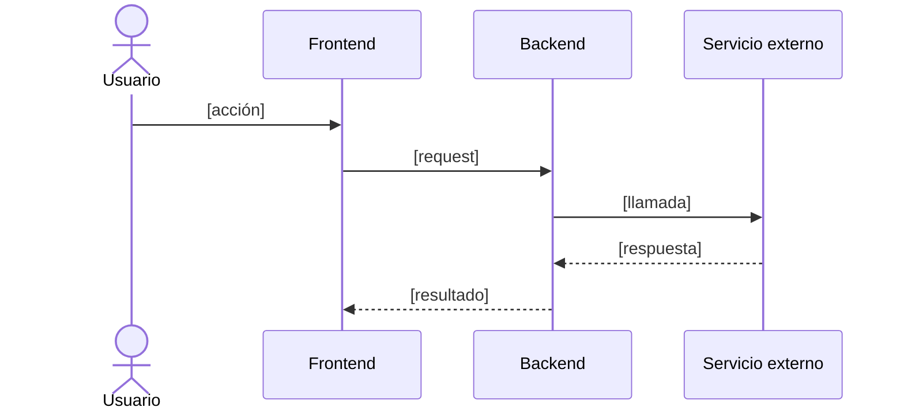

> generado por /docs-fyd [FECHA] — se regenera, no editar a mano.

# Diagramas de secuencia — [Nombre de la aplicación]

Los 2-3 procesos de negocio más relevantes (ej.: alta de un registro, una aprobación, una notificación automática), mostrando la interacción entre usuario, frontend, backend, base de datos y servicios externos.

## [Proceso 1 — ej.: alta de un registro]

## [Proceso 2 — ...]

